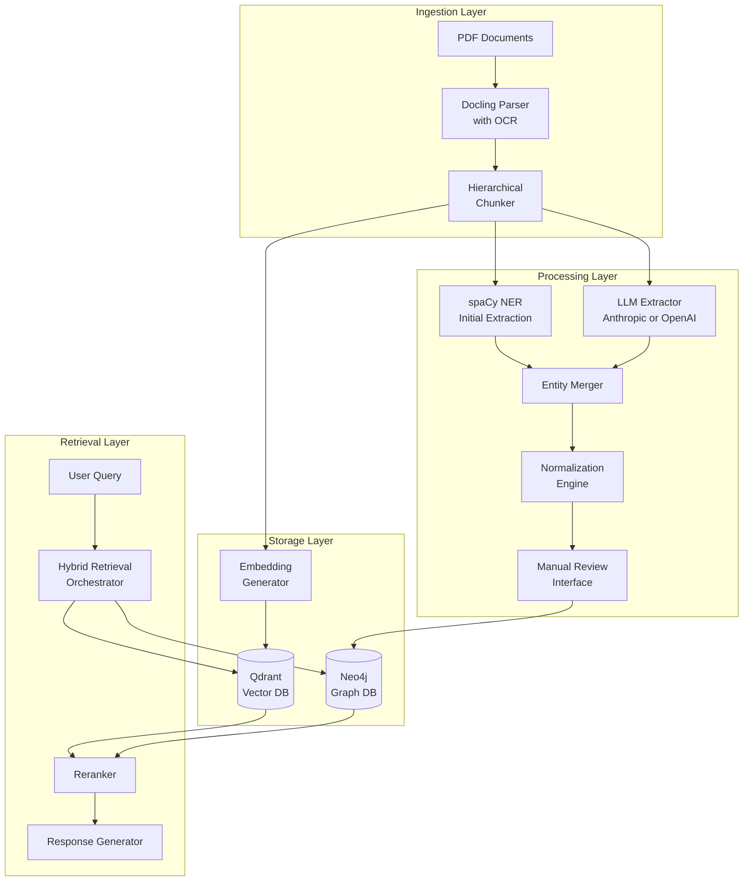
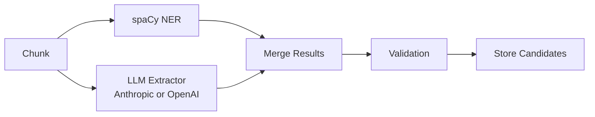
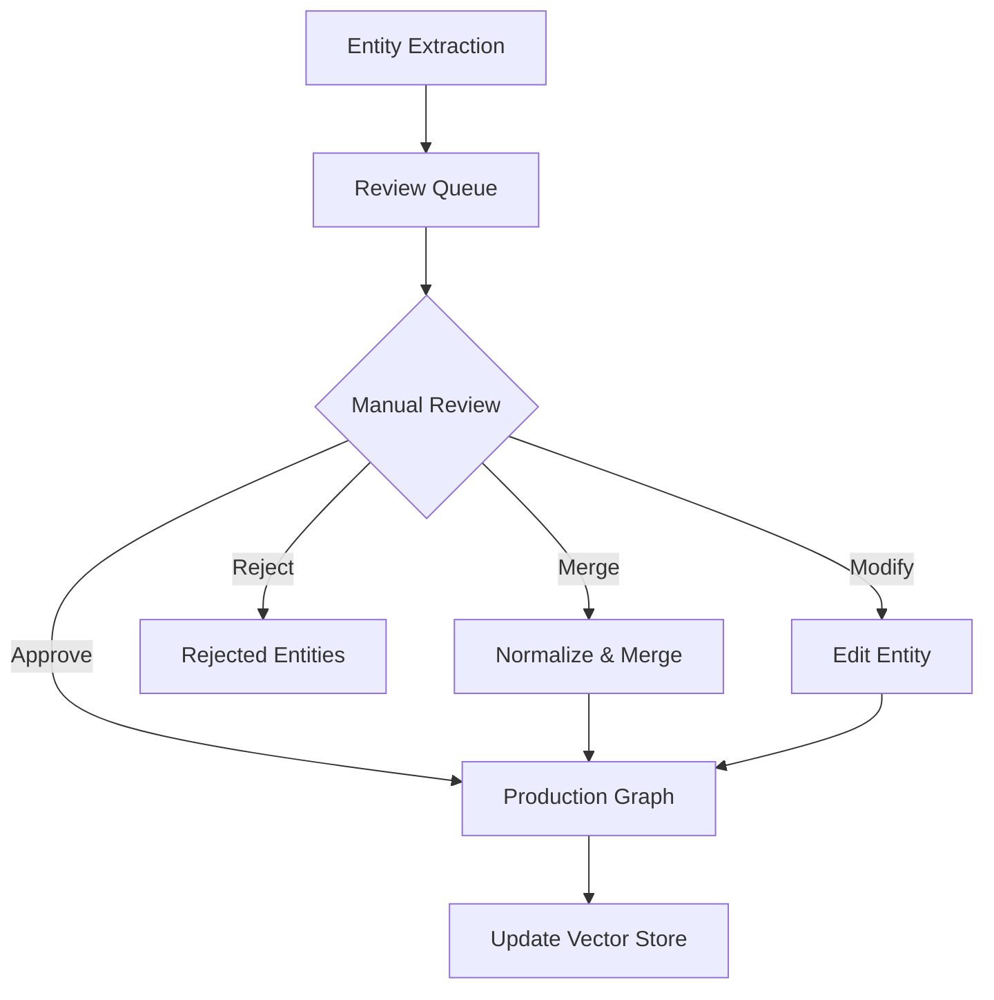
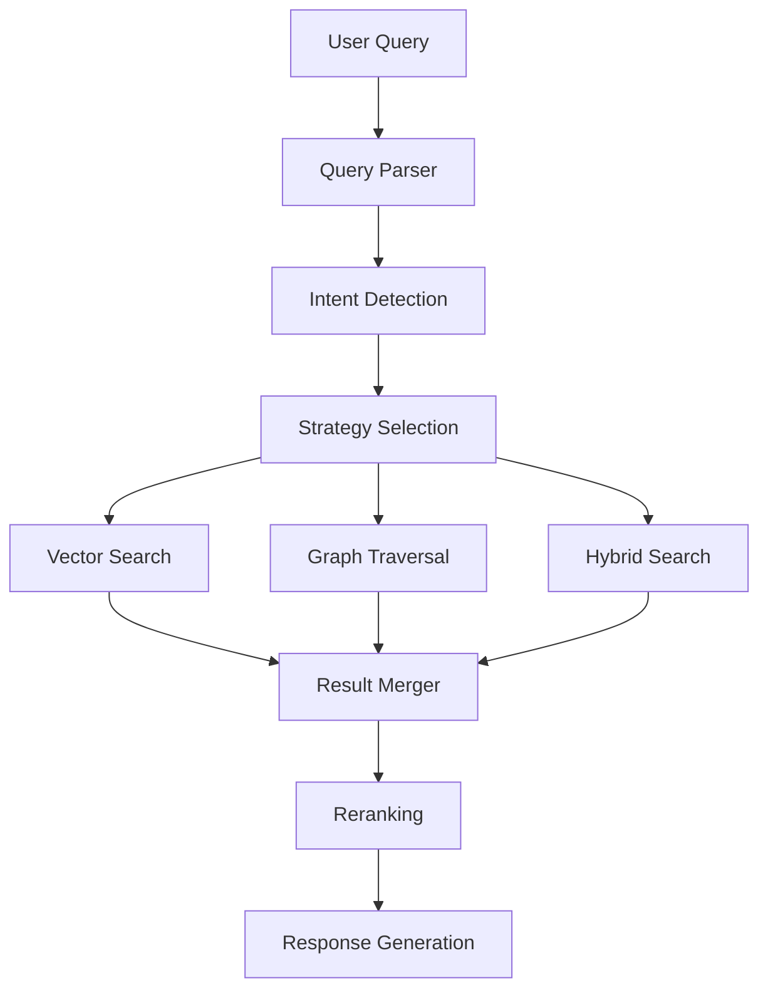

# Graph RAG System Architecture for Satellite Technical Documents

## Executive Summary

This document outlines the architecture for a graph-based Retrieval-Augmented Generation (RAG) system designed to process 100-500 satellite technical documents and standard operating procedures. The system combines vector similarity search with knowledge graph traversal to enable complex queries across technical documentation.

**Key Design Principles:**
- Configurable LLM: Use Anthropic (local) or OpenAI API based on configuration
- Incremental updates: Handle document modifications without full reprocessing
- Entity discovery: Automated extraction with manual curation workflow
- Hierarchical structure: Multi-level document representation for flexible querying
- Simple orchestration: Script-based pipeline, no heavy frameworks

---

## System Architecture Overview



---

## Component Design

### 1. Ingestion Pipeline

#### 1.1 PDF Parser (Docling + OCR)
**Purpose:** Convert PDF documents into structured text with layout preservation

**Components:**
- Docling parser with OCR capabilities
- Document metadata extractor (title, date, version, author)
- Layout structure analyzer (sections, subsections, tables, figures)

**Output:**
```python
{
    "document_id": "uuid",
    "metadata": {
        "filename": "satellite_sop_001.pdf",
        "title": "Power Subsystem Operating Procedures",
        "version": "2.3",
        "date": "2024-12-01",
        "page_count": 45
    },
    "structure": {
        "sections": [
            {
                "level": 1,
                "title": "Introduction",
                "content": "...",
                "start_page": 1,
                "subsections": [...]
            }
        ]
    },
    "raw_text": "full document text..."
}
```

**Key Considerations:**
- Preserve document structure for hierarchical chunking
- Extract and store table data separately
- Maintain page number references for source citations
- Handle multi-column layouts common in technical docs

---

#### 1.2 Text Cleaning and Preprocessing
**Purpose:** Clean and preprocess parsed text to remove noise and unwanted content

**Cleaning Operations:**
- Remove headers and footers using regex patterns
- Strip page numbers and repeated metadata
- Remove watermarks and boilerplate text
- Clean up extra whitespace and formatting artifacts
- Filter out common OCR errors
- Remove or normalize special characters
- Preserve technical terminology and formatting (e.g., code snippets, equations)

**Configuration:**
- Regex patterns defined in [`config/cleaning_patterns.yaml`]
- Pattern categories: headers, footers, page_numbers, watermarks, noise, ocr_errors
- Patterns can be enabled/disabled per document type
- Custom patterns can be added for specific document series
- Whitelist patterns to preserve important content

**Output:**
Cleaned text with noise removed while preserving meaningful technical content

---

#### 1.3 Optional LLM Text Rewriting
**Purpose:** Use LLM to rewrite text for improved readability and parsing, while preserving information

**When to Use:**
- Documents with poor formatting or structure
- Legacy documents with inconsistent style
- OCR output with errors that cleaning can't fully address
- Documents that need condensing without losing key information

**Rewriting Strategy:**
- Process in chunks (section or subsection level)
- Preserve all technical terms, numbers, and relationships
- Improve sentence structure and clarity
- Remove redundancy while keeping essential information
- Maintain original meaning and context
- Add explicit connections between concepts when implicit

**LLM Prompt Guidelines:**
```
Rewrite the following technical text to be clear and concise while:
1. Preserving ALL technical terms, acronyms, and specific details
2. Maintaining all numerical values, measurements, and specifications
3. Keeping all relationships between components/systems explicit
4. Improving readability and sentence structure
5. Removing redundant phrasing but keeping essential context
6. Using consistent terminology throughout
```

**Configuration:**
- Optional step (disabled by default due to cost/time)
- Configurable chunk size for rewriting
- Uses configured LLM (Anthropic or OpenAI)
- Can be applied selectively to specific documents
- Tracks original and rewritten versions for comparison

**Output:**
Rewritten text that is more concise and readable while preserving all critical information

---

#### 1.4 Hierarchical Chunker
**Purpose:** Create multi-level chunks that support different query granularities

**Chunking Strategy:**
- **Level 1 (Document):** Entire document as single unit with metadata
- **Level 2 (Section):** Major sections (Introduction, Procedures, Safety, etc.)
- **Level 3 (Subsection):** Detailed subsections and procedures
- **Level 4 (Paragraph):** Individual paragraphs and procedure steps

**Chunk Structure:**
```python
{
    "chunk_id": "uuid",
    "document_id": "uuid",
    "level": 2,  # 1=doc, 2=section, 3=subsection, 4=paragraph
    "parent_chunk_id": "uuid",  # Reference to parent chunk
    "child_chunk_ids": ["uuid1", "uuid2"],  # References to children
    "content": "chunk text content",
    "metadata": {
        "section_title": "Power Management Procedures",
        "page_numbers": [5, 6, 7],
        "hierarchy_path": "1.2.3"  # Section numbering
    },
    "token_count": 450
}
```

**Benefits:**
- Support multi-hop queries across document levels
- Enable precise retrieval (paragraph level) and contextual retrieval (section level)
- Preserve document structure for graph relationships

---

### 2. Entity and Relationship Extraction

#### 2.1 Extraction Pipeline Architecture

**Two-Stage Approach:**

**Stage 1: Baseline Extraction (spaCy NER)**
- Fast, rule-based extraction
- Focus on standard entities: organizations, systems, technologies
- Custom domain-specific patterns for satellite terminology
- Confidence scoring based on context

**Stage 2: LLM-Enhanced Extraction**
- **Configurable LLM:** Use either Anthropic (local) or OpenAI API based on configuration
- Structured output format for entities and relationships
- Prompt engineering for satellite domain
- Same interface regardless of backend (Anthropic or OpenAI)

**Extraction Flow:**


#### 2.2 Entity Types (Initial Schema)

**Core Entity Categories:**
1. **SYSTEM**: Top-level satellite systems (Power, Thermal, Communications)
2. **SUBSYSTEM**: Components within systems (Battery, Solar Array, Transponder)
3. **COMPONENT**: Individual parts (Sensor, Actuator, Circuit)
4. **PARAMETER**: Measurable values (Temperature, Voltage, Pressure)
5. **PROCEDURE**: Operational procedures (Startup, Shutdown, Calibration)
6. **PROCEDURE_STEP**: Individual steps within procedures
7. **CONCEPT**: Technical concepts (Redundancy, Fault Tolerance)
8. **DOCUMENT**: Source documents themselves
9. **STANDARD**: Referenced standards (ISO, NASA, ESA)
10. **ANOMALY**: Known issues or failure modes
11. **TABLE**: Tables with structured data (specifications, parameters, test results)
12. **FIGURE**: Diagrams, charts, schematics with captions

**Enhancement: Table/Figure as First-Class Entities**
Tables and figures contain critical technical information. By treating them as entities, we can:
- Query "What procedures reference Table 5?"
- Track "Which parameters are defined in Figure 3?"
- Create relationships: `REFERENCES_TABLE`, `DEFINED_IN_TABLE`, `SHOWN_IN_FIGURE`

**Entity Schema:**
```python
{
    "entity_id": "uuid",
    "canonical_name": "solar_array_deployment_mechanism",
    "entity_type": "SUBSYSTEM",
    "aliases": ["SADM", "Solar Array Deployment", "deployment mechanism"],
    "properties": {
        "description": "Mechanism for deploying solar arrays...",
        "abbreviations": ["SADM"],
        "confidence_score": 0.92,
        "extraction_method": "llm",  # spacy, llm, manual
        "first_seen": "2024-12-14",
        "mention_count": 23,
        "source_documents": ["doc_uuid_1", "doc_uuid_2"]
    }
}
```

#### 2.3 Relationship Types (Initial Schema)

**Structural Relationships:**
- `PART_OF`: Component is part of a larger system
- `CONTAINS`: System contains subsystems/components
- `DEPENDS_ON`: Component depends on another for operation

**Functional Relationships:**
- `CONTROLS`: System/component controls another
- `MONITORS`: System monitors parameter/component
- `PROVIDES_POWER_TO`: Power distribution relationships
- `SENDS_DATA_TO`: Data flow relationships

**Procedural Relationships:**
- `REFERENCES`: Procedure references system/component
- `PRECEDES`: Procedure step order
- `REQUIRES_CHECK`: Procedure requires parameter verification
- `AFFECTS`: Action affects system/component state

**Semantic Relationships:**
- `IMPLEMENTS`: Component implements concept/standard
- `SIMILAR_TO`: Related concepts/components
- `CAUSED_BY`: Anomaly causation
- `MITIGATED_BY`: Anomaly mitigation procedures

**Relationship Schema:**
```python
{
    "relationship_id": "uuid",
    "type": "DEPENDS_ON",
    "source_entity_id": "uuid",
    "target_entity_id": "uuid",
    "properties": {
        "description": "Battery depends on solar array for charging",
        "confidence_score": 0.88,
        "bidirectional": false,
        "source_chunks": ["chunk_uuid_1"],
        "extraction_method": "llm"
    }
}
```

---

### 3. Normalization and Entity Resolution

#### 3.1 Normalization Pipeline

**Multi-Step Process:**

1. **String Normalization:**
   - Lowercase canonical names
   - Remove extra whitespace
   - Standardize punctuation (while preserving technical meaning)

2. **Fuzzy Matching:**
   - Use RapidFuzz for similarity scoring (threshold: 90%)
   - Match entities across different mentions
   - Handle typos and minor variations

3. **Acronym Resolution:**
   - Pattern-based extraction: "Telemetry and Command (T&C)"
   - Build acronym dictionary from corpus
   - Context-based disambiguation for multi-meaning acronyms

4. **Semantic Similarity:**
   - Use embeddings to find conceptually similar entities
   - Cluster similar entities for manual review
   - Suggest merge candidates

**Normalization Table Structure:**
```python
{
    "raw_text": "T&C System",
    "normalized_text": "telemetry_and_command_system",
    "canonical_entity_id": "uuid",
    "normalization_confidence": 0.95,
    "normalization_method": "acronym_resolution"
}
```

#### 3.2 Entity Deduplication Strategy

1. **Exact Match:** Same canonical name after normalization
2. **Fuzzy Match:** High string similarity (>90%)
3. **Embedding Similarity:** High semantic similarity (>0.85)
4. **Co-occurrence:** Frequently appear in same contexts

**Merge Decision Logic:**
- Automatic merge: Exact match + same entity type
- Suggest for review: Fuzzy/semantic match + same entity type
- Flag for manual review: Different entity types or low confidence

---

### 4. Storage Layer

#### 4.1 Neo4j Graph Database Schema

**Node Labels:**
- `Document`: Source PDF documents
- `Chunk`: Hierarchical document chunks
- `System`, `Subsystem`, `Component`: Physical entities
- `Parameter`: Measurable values
- `Procedure`, `ProcedureStep`: Operational procedures
- `Concept`, `Standard`, `Anomaly`: Knowledge entities

**Node Properties (Example: System):**
```cypher
CREATE (s:System {
    id: 'uuid',
    canonical_name: 'power_subsystem',
    aliases: ['Power System', 'EPS', 'Electrical Power Subsystem'],
    entity_type: 'SYSTEM',
    description: 'Manages satellite electrical power',
    confidence_score: 0.95,
    first_seen: datetime(),
    last_updated: datetime(),
    mention_count: 45,
    extraction_method: 'llm',
    status: 'approved'  // draft, under_review, approved
})
```

**Relationship Types:**
- Structural: `PART_OF`, `CONTAINS`, `DEPENDS_ON`
- Functional: `CONTROLS`, `MONITORS`, `PROVIDES_POWER_TO`, `SENDS_DATA_TO`
- Procedural: `REFERENCES`, `PRECEDES`, `REQUIRES_CHECK`, `AFFECTS`
- Semantic: `IMPLEMENTS`, `SIMILAR_TO`, `CAUSED_BY`, `MITIGATED_BY`
- Document: `MENTIONED_IN`, `PARENT_CHUNK`, `CHILD_CHUNK`

**Relationship Properties (Example: DEPENDS_ON):**
```cypher
CREATE (a)-[r:DEPENDS_ON {
    id: 'uuid',
    description: 'Battery charging depends on solar array output',
    confidence_score: 0.88,
    created_at: datetime(),
    source_chunks: ['chunk_uuid_1', 'chunk_uuid_2'],
    extraction_method: 'llm',
    bidirectional: false
}]->(b)
```

**Indexes:**
```cypher
CREATE INDEX entity_canonical FOR (n:System|Subsystem|Component) ON (n.canonical_name);
CREATE INDEX entity_type FOR (n) ON (n.entity_type);
CREATE INDEX document_id FOR (n:Document) ON (n.id);
CREATE FULLTEXT INDEX entity_search FOR (n:System|Subsystem|Component|Concept) ON EACH [n.canonical_name, n.aliases, n.description];
```

#### 4.2 Qdrant Vector Database Schema

**Collection: document_chunks**
- Purpose: Store chunk embeddings for semantic search
- Vector size: 768 (or 1536 for OpenAI embeddings)
- Distance metric: Cosine similarity

**Payload Structure:**
```python
{
    "chunk_id": "uuid",
    "document_id": "uuid",
    "level": 2,  # Chunk hierarchy level
    "content": "chunk text",
    "metadata": {
        "document_title": "Power Subsystem SOP",
        "section_title": "Startup Procedures",
        "page_numbers": [5, 6],
        "hierarchy_path": "1.2.3",
        "entity_ids": ["uuid1", "uuid2"],  # Entities mentioned in chunk
        "has_tables": false,
        "has_figures": false
    },
    "timestamp": "2024-12-14T08:00:00Z"
}
```

**Collection: entities**
- Purpose: Store entity description embeddings
- Vector size: 768
- Distance metric: Cosine similarity

**Payload Structure:**
```python
{
    "entity_id": "uuid",
    "canonical_name": "solar_array_deployment_mechanism",
    "entity_type": "SUBSYSTEM",
    "description": "full description text",
    "aliases": ["SADM", "Solar Array Deployment"],
    "related_entity_ids": ["uuid1", "uuid2"]  # From graph traversal
}
```

**Indexes:**
- HNSW index for fast approximate search
- Payload indexes on: document_id, entity_ids, entity_type

---

### 5. Entity Discovery and Curation Workflow

#### 5.1 Discovery Phase

**Initial Corpus Analysis:**
1. Process all documents through extraction pipeline
2. Collect all candidate entities and relationships
3. Generate statistics: frequency, co-occurrence, distribution
4. Cluster similar entities using embeddings
5. Identify high-confidence vs. low-confidence extractions

**Output: Entity Candidate Database**
```python
{
    "candidate_id": "uuid",
    "raw_mentions": ["EPS", "Electrical Power System", "power subsystem"],
    "suggested_canonical_name": "electrical_power_subsystem",
    "entity_type": "SYSTEM",
    "confidence_score": 0.87,
    "mention_count": 34,
    "source_documents": ["doc1", "doc2", "doc3"],
    "merge_suggestions": ["candidate_uuid_2"],  # Similar candidates
    "status": "pending_review"
}
```

#### 5.2 Curation Interface (CLI/Web)

**Features:**
1. **Review Queue:**
   - Sort by confidence, frequency, entity type
   - Filter by confidence thresholds
   - Batch operations for similar entities

2. **Entity Actions:**
   - Approve (move to production graph)
   - Merge with existing entity
   - Reject (mark as noise)
   - Modify (edit canonical name, type, description)
   - Split (one mention represents multiple entities)

3. **Relationship Review:**
   - Approve extracted relationships
   - Add missing relationships manually
   - Modify relationship types
   - Add relationship descriptions

4. **Batch Operations:**
   - Approve all high-confidence entities (>0.9)
   - Merge similar entities in bulk
   - Auto-approve standard entity types

**Review Workflow:**


#### 5.3 Continuous Discovery

**Periodic Re-Analysis:**
- Run discovery on new documents
- Identify new entity types not in current schema
- Suggest new relationship patterns
- Update entity statistics (mention counts, co-occurrences)

**Feedback Loop:**
- Track which entities are frequently queried
- Identify gaps in entity coverage
- Suggest entities to add based on query patterns
- Refine extraction prompts based on curation decisions

---

### 6. Hybrid Retrieval System

#### 6.1 Retrieval Architecture

**Query Flow:**


#### 6.2 Retrieval Strategies

**1. Vector-First Strategy:**
- Use case: Semantic search, concept similarity
- Process:
  1. Generate query embedding
  2. Search Qdrant for similar chunks (top-k=20)
  3. Extract entity IDs from retrieved chunks
  4. Query Neo4j for entity relationships
  5. Expand context with connected entities

**2. Graph-First Strategy:**
- Use case: Relationship queries, hierarchical exploration
- Process:
  1. Extract entity mentions from query (NER)
  2. Map to canonical entities in Neo4j
  3. Execute graph traversal (Cypher queries)
  4. Retrieve associated chunks from vector store
  5. Rank by relevance to query

**3. Hybrid Strategy:**
- Use case: Complex queries requiring both semantic and structural understanding
- Process:
  1. Parallel execution: vector search + graph traversal
  2. Score combination: weighted average or learned fusion
  3. Diversity ranking: ensure coverage of different aspects

**Example Query Processing:**

Query: "What procedures must be followed before deploying the solar array?"

1. **Intent Detection:** Procedural query with precondition relationships
2. **Entity Extraction:** "solar array" → `solar_array_deployment_mechanism`
3. **Graph Traversal:**
   ```cypher
   MATCH (proc:Procedure)-[:PRECEDES*]->(target:Procedure)-[:REFERENCES]->(entity:Subsystem {canonical_name: 'solar_array_deployment_mechanism'})
   RETURN proc, path
   ```
4. **Vector Search:** Find chunks mentioning "deployment procedures" + "prerequisites"
5. **Merge & Rank:** Combine graph paths with relevant chunks
6. **Generate Response:** Synthesize answer from retrieved context

#### 6.3 Query Types and Strategies

**Multi-hop Relationship Queries:**
- Example: "What components affect the thermal control system?"
- Strategy: Graph-first with path finding
- Cypher: `MATCH path=(c:Component)-[*1..3]->(t:System {canonical_name: 'thermal_control'}) RETURN path`

**Hierarchical Queries:**
- Example: "What are all subsystems of the attitude control system?"
- Strategy: Graph-first with hierarchical traversal
- Cypher: `MATCH (s:System {canonical_name: 'attitude_control'})-[:CONTAINS*]->(sub) RETURN sub`

**Temporal/Sequential Queries:**
- Example: "What happens after thermal initialization?"
- Strategy: Graph-first with sequential relationships
- Cypher: `MATCH (start:ProcedureStep {name: 'thermal_initialization'})-[:PRECEDES*]->(next) RETURN next ORDER BY depth`

**Semantic Concept Queries:**
- Example: "Explain redundancy in satellite power systems"
- Strategy: Vector-first with graph expansion
- Process: Vector search for "redundancy" → expand to connected entities in power domain

**Cross-document Queries:**
- Example: "Compare startup procedures across all subsystems"
- Strategy: Hybrid with document-level aggregation
- Process: Vector search for "startup procedures" → group by system → graph traversal for relationships

#### 6.4 Reranking and Scoring

**Reranking Criteria:**
1. **Relevance Score:** Combined vector similarity + graph distance
2. **Entity Coverage:** How many query entities are covered
3. **Relationship Completeness:** Are key relationships represented?
4. **Source Diversity:** Multiple documents vs. single source
5. **Confidence Scores:** Higher confidence entities/relationships ranked higher
6. **Chunk Level:** Prefer appropriate hierarchy level for query type

**Scoring Formula:**
```python
final_score = (
    0.4 * vector_similarity +
    0.3 * graph_relevance +
    0.15 * entity_coverage +
    0.10 * confidence_score +
    0.05 * source_diversity
)
```

---

### 7. Incremental Update Strategy

#### 7.1 Update Detection

**Document Change Tracking:**
```python
{
    "document_id": "uuid",
    "filename": "satellite_sop_001.pdf",
    "version": "2.3",
    "checksum": "sha256_hash",
    "last_processed": "2024-12-14T08:00:00Z",
    "status": "up_to_date"  # new, modified, up_to_date, deleted
}
```

**Change Detection Logic:**
1. Compare file checksum with stored hash
2. If changed, mark as "modified"
3. If new file, mark as "new"
4. Track deleted files

#### 7.2 Update Processing

**For Modified Documents:**
1. **Identify Affected Chunks:**
   - Re-parse document
   - Compare with existing chunks
   - Identify changed/added/deleted sections

2. **Entity Update Strategy:**
   - Extract entities from changed chunks
   - Compare with existing entities from this document
   - Update mention counts
   - Flag entities unique to deleted chunks for review

3. **Relationship Update Strategy:**
   - Re-extract relationships from changed chunks
   - Compare with existing relationships
   - Mark outdated relationships for review
   - Add new relationships

4. **Vector Store Update:**
   - Delete vectors for removed chunks
   - Update vectors for modified chunks
   - Add vectors for new chunks

5. **Graph Update:**
   - Soft-delete outdated relationships (mark as inactive)
   - Update entity properties (mention counts, last_seen)
   - Add new entities/relationships with "pending_review" status

#### 7.3 Versioning Strategy

**Document Versioning:**
- Keep track of document versions in metadata
- Optionally maintain historical graph snapshots
- Tag entities/relationships with version ranges

**Entity Versioning:**
- Track when entities were added/modified
- Maintain audit trail of changes
- Support rollback if needed

---

### 8. Technology Stack and Dependencies

#### 8.1 Core Dependencies

**PDF Processing:**
- `docling`: PDF parsing with layout analysis
- `pytesseract` or `easyocr`: OCR capabilities
- `pypdf`: PDF metadata extraction

**NLP and Entity Extraction:**
- `spaCy` (v3.7+): NER and linguistic features
- `en_core_web_trf`: Transformer-based English model
- Custom spaCy pipeline components for domain terms

**LLM Integration:**
- `openai`: OpenAI API integration (or any OpenAI-compatible endpoint)
- `anthropic`: Anthropic Messages API
- `langchain`: Optional for structured output handling

**Graph Database:**
- `neo4j` (v5.x): Graph database
- `py2neo` or `neo4j-driver`: Python driver
- `neo4j-admin`: Database management tools

**Vector Database:**
- `qdrant-client`: Qdrant Python client
- `fastembed`: Fast embedding generation
- Alternative: `sentence-transformers` for custom embeddings

**Normalization and Matching:**
- `rapidfuzz`: Fast fuzzy string matching
- `scikit-learn`: Clustering for entity deduplication
- `numpy`: Vector operations

**Utilities:**
- `pydantic`: Data validation and serialization
- `loguru`: Enhanced logging
- `typer`: CLI interface
- `python-dotenv`: Environment configuration

#### 8.2 Project Structure

```
ragagent2/
├── src/
│   ├── ingestion/
│   │   ├── pdf_parser.py        # Docling PDF parsing
│   │   ├── text_cleaner.py      # Text cleaning and preprocessing
│   │   ├── text_rewriter.py     # Optional LLM-based text rewriting
│   │   ├── chunker.py           # Hierarchical chunking
│   │   └── metadata_extractor.py
│   ├── extraction/
│   │   ├── spacy_extractor.py   # spaCy NER extraction
│   │   ├── llm_extractor.py     # LLM-based extraction (Anthropic or OpenAI)
│   │   └── entity_merger.py
│   ├── normalization/
│   │   ├── string_normalizer.py
│   │   ├── acronym_resolver.py
│   │   ├── entity_deduplicator.py
│   │   └── normalization_table.py
│   ├── storage/
│   │   ├── neo4j_manager.py     # Graph DB operations
│   │   ├── qdrant_manager.py    # Vector DB operations
│   │   └── schemas.py           # Data schemas
│   ├── retrieval/
│   │   ├── query_parser.py
│   │   ├── vector_retriever.py
│   │   ├── graph_retriever.py
│   │   ├── hybrid_retriever.py
│   │   └── reranker.py
│   ├── curation/
│   │   ├── review_interface.py  # CLI/Web interface
│   │   ├── entity_approval.py
│   │   └── batch_operations.py
│   ├── pipeline/
│   │   ├── ingestion_pipeline.py
│   │   ├── update_pipeline.py
│   │   └── discovery_pipeline.py
│   └── utils/
│       ├── config.py
│       ├── logger.py
│       └── embeddings.py
├── scripts/
│   ├── setup_databases.py       # Initialize Neo4j & Qdrant
│   ├── ingest_documents.py      # Batch document ingestion
│   ├── run_discovery.py         # Entity discovery
│   ├── review_entities.py       # Curation interface
│   └── query_system.py          # Query interface
├── tests/
│   ├── test_ingestion/
│   ├── test_extraction/
│   ├── test_normalization/
│   └── test_retrieval/
├── config/
│   ├── config.yaml              # Main configuration
│   ├── cleaning_patterns.yaml   # Text cleaning regex patterns
│   ├── entity_schema.yaml       # Entity type definitions
│   ├── relationship_schema.yaml # Relationship type definitions
│   └── extraction_prompts.yaml  # LLM prompts
├── data/
│   ├── raw/                     # Input PDFs
│   ├── processed/               # Parsed documents
│   ├── entities/                # Entity candidates
│   └── normalization/           # Normalization tables
├── plans/
│   └── graph-rag-architecture.md
├── .env.example
├── .gitignore
├── pyproject.toml
└── README.md
```

---

## Implementation Phases

### Phase 1: Foundation (Weeks 1-2)
**Goal:** Set up core infrastructure and basic ingestion

**Tasks:**
1. Set up development environment (Neo4j, Qdrant, Anthropic)
2. Implement PDF parsing with Docling
3. Implement text cleaning and preprocessing
4. Implement optional LLM text rewriting
5. Implement hierarchical chunking
6. Set up Neo4j graph schema (nodes, relationships, indexes)
7. Set up Qdrant collections and indexes
8. Create basic data models and schemas
9. Implement embedding generation
10. Basic storage layer (write chunks to both DBs)

**Deliverable:** System can ingest PDFs and store hierarchical chunks in both databases

### Phase 2: Entity Extraction (Weeks 3-4)
**Goal:** Extract entities and relationships from documents

**Tasks:**
1. Implement spaCy NER pipeline with custom patterns
2. Set up LLM integration (Anthropic or OpenAI based on configuration)
3. Create LLM extraction prompts for entities/relationships
4. Implement entity merger (combine spaCy + LLM results)
5. Build entity candidate database
6. Implement confidence scoring
7. Create extraction pipeline orchestration

**Deliverable:** System extracts entity and relationship candidates from documents

### Phase 3: Normalization & Curation (Weeks 5-6)
**Goal:** Clean and deduplicate entities, build curation workflow

**Tasks:**
1. Implement string normalization
2. Implement fuzzy matching with RapidFuzz
3. Build acronym resolution system
4. Implement entity deduplication with embeddings
5. Create normalization table
6. Build CLI-based review interface
7. Implement entity approval/merge/reject operations
8. Create batch operation tools
9. Implement feedback loop to production graph

**Deliverable:** Manual curation workflow for approving entities

### Phase 4: Retrieval System (Weeks 7-8)
**Goal:** Build hybrid retrieval with query processing

**Tasks:**
1. Implement query parser and intent detection
2. Build vector retriever (semantic search)
3. Build graph retriever (Cypher queries)
4. Implement hybrid retriever (combine both)
5. Create reranking system
6. Build query strategy selector
7. Implement response generation
8. Create query interface (CLI)
9. Add support for different query types

**Deliverable:** Working end-to-end retrieval system

### Phase 5: Incremental Updates (Week 9)
**Goal:** Handle document modifications efficiently

**Tasks:**
1. Implement document change detection
2. Build differential update logic
3. Create chunk comparison system
4. Implement entity/relationship update strategy
5. Add soft-delete for outdated data
6. Create update pipeline
7. Add versioning support

**Deliverable:** System can handle document updates without full reprocessing

### Phase 6: Discovery & Polish (Week 10)
**Goal:** Entity discovery workflow and system refinement

**Tasks:**
1. Build corpus-wide entity analysis
2. Implement entity clustering and statistics
3. Create discovery report generation
4. Add monitoring and logging
5. Performance optimization
6. Documentation and deployment guide
7. Testing and validation

**Deliverable:** Production-ready system with discovery workflow

---

## Configuration Management

### Environment Variables (.env)
```bash
# Neo4j Configuration
NEO4J_URI=bolt://localhost:7687
NEO4J_USER=neo4j
NEO4J_PASSWORD=your_password

# Qdrant Configuration
QDRANT_HOST=localhost
QDRANT_PORT=6333
QDRANT_API_KEY=optional

# LLM Configuration
OPENAI_BASE_URL=https://api.openai.com/v1  # Point to OpenAI-compatible endpoint
OPENAI_MODEL=gpt-4o-mini
OPENAI_API_KEY=your_key_if_using_api
ANTHROPIC_API_KEY=your_key_if_using_api

# Embedding Configuration
EMBEDDING_MODEL=BAAI/bge-small-en-v1.5
EMBEDDING_DIMENSION=768

# Pipeline Configuration
BATCH_SIZE=10
MAX_CHUNK_SIZE=512
CHUNK_OVERLAP=50
```

### Configuration File (config.yaml)
```yaml
ingestion:
  pdf_parser:
    ocr_enabled: true
    preserve_layout: true
    extract_tables: true
  
  text_cleaning:
    enabled: true
    patterns_file: config/cleaning_patterns.yaml
    remove_headers: true
    remove_footers: true
    remove_page_numbers: true
    min_line_length: 3
    normalize_whitespace: true
    preserve_code_blocks: true
    preserve_equations: true
  
  text_rewriting:
    enabled: false  # Optional, disabled by default
    llm:
      provider: openai  # Can use different provider than extraction LLM
      base_url: https://api.openai.com/v1  # Point to OpenAI-compatible endpoint if self-hosting
      model: gpt-4o-mini  # Can use different model than extraction
      temperature: 0.3  # Slightly higher for more natural rewriting
      max_tokens: 3000
    chunk_level: section  # section or subsection
    preserve_original: true  # Keep original for comparison
    max_chunk_tokens: 2000
    prompt_template: config/rewriting_prompt.yaml
  
  chunking:
    strategy: hierarchical
    levels:
      - document
      - section
      - subsection
      - paragraph
    max_tokens: 512
    overlap_tokens: 50

extraction:
  spacy:
    model: en_core_web_lg
    custom_patterns: config/entity_patterns.jsonl
  
  llm:
    provider: openai  # OpenAI-compatible endpoint
    base_url: https://api.openai.com/v1
    model: gpt-4o-mini
    temperature: 0.1
    max_tokens: 2000
  
  entity_types:
    - SYSTEM
    - SUBSYSTEM
    - COMPONENT
    - PARAMETER
    - PROCEDURE
    - PROCEDURE_STEP
    - CONCEPT
    - DOCUMENT
    - STANDARD
    - ANOMALY

normalization:
  fuzzy_threshold: 0.90
  embedding_similarity_threshold: 0.85
  auto_merge_threshold: 0.95

retrieval:
  vector_search:
    top_k: 20
    min_score: 0.5
  
  graph_search:
    max_depth: 3
    relationship_types:
      - PART_OF
      - DEPENDS_ON
      - REFERENCES
  
  reranking:
    weights:
      vector_similarity: 0.4
      graph_relevance: 0.3
      entity_coverage: 0.15
      confidence: 0.10
      diversity: 0.05
```

---

## Deployment and Operations

### Development Setup

1. **Install Dependencies:**
```bash
pip install -e .
```

2. **Start Infrastructure:**
```bash
# Start Neo4j
docker run -p 7474:7474 -p 7687:7687 -e NEO4J_AUTH=neo4j/password neo4j:latest

# Start Qdrant
docker run -p 6333:6333 qdrant/qdrant

# Configure OpenAI-compatible endpoint (api.openai.com or self-hosted)
export OPENAI_BASE_URL=https://api.openai.com/v1
export OPENAI_API_KEY=sk-...
# For local servers, point OPENAI_BASE_URL to the local address (e.g., http://localhost:8000/v1)
```

3. **Initialize Databases:**
```bash
python scripts/setup_databases.py
```

4. **Ingest Documents:**
```bash
python scripts/ingest_documents.py --input data/raw/ --batch-size 10
```

5. **Run Discovery:**
```bash
python scripts/run_discovery.py --confidence-threshold 0.7
```

6. **Review Entities:**
```bash
python scripts/review_entities.py
```

7. **Query System:**
```bash
python scripts/query_system.py "What procedures reference the thermal control system?"
```

### Production Considerations

**Security:**
- Use strong credentials for databases
- Secure API keys in environment variables
- Implement access controls if multi-user
- Use HTTPS for API endpoints if exposed
- Keep local models updated for security patches

**Monitoring:**
- Log all pipeline operations
- Track extraction quality metrics
- Monitor database performance
- Alert on failed ingestion jobs

**Backup:**
- Regular Neo4j backups
- Qdrant snapshot backups
- Version control for configuration
- Store normalization tables

**Scaling:**
- Neo4j Enterprise for clustering (if needed)
- Qdrant sharding for large collections
- Distributed extraction processing
- Caching for frequent queries

---

## Success Metrics

**Quality Metrics:**
- Entity extraction precision/recall
- Relationship extraction accuracy
- Normalization accuracy (manual spot-checks)
- Query relevance (user feedback)

**Performance Metrics:**
- Document ingestion time
- Query response time (<2s for simple, <5s for complex)
- Embedding generation throughput
- Graph traversal efficiency

**Operational Metrics:**
- Curation throughput (entities reviewed per hour)
- Update processing time
- System uptime
- Storage usage

---

## Risks and Mitigations

**Risk: Poor entity extraction quality**
- Mitigation: Start with manual review of samples, iterate on prompts
- Mitigation: Use multiple extraction methods and merge results
- Mitigation: Build domain-specific spaCy patterns

**Risk: Entity explosion (too many low-quality entities)**
- Mitigation: Use confidence thresholds
- Mitigation: Require minimum mention count
- Mitigation: Periodic pruning of unused entities

**Risk: Slow query performance**
- Mitigation: Proper indexing in Neo4j and Qdrant
- Mitigation: Query optimization and caching
- Mitigation: Limit graph traversal depth

**Risk: Storage growth**
- Mitigation: Chunking strategy balances granularity and size
- Mitigation: Regular cleanup of outdated data
- Mitigation: Compression for vector storage

**Risk: LLM costs or availability**
- Mitigation: Hybrid approach allows fallback to local models
- Mitigation: Batch processing to optimize API usage
- Mitigation: Cache extraction results

---

## Critical Enhancements Integrated into Design

The following six enhancements have been integrated into the architecture to significantly improve system capabilities for technical document processing:

### Enhancement 1: Table & Figure Extraction as Entities ✅

**Impact:** Critical for technical documents
**Added to:** Entity schema (Section 2.2), PDF parsing (Section 1.1)

Tables and figures are now first-class graph entities with their own node types (`TABLE`, `FIGURE`). This enables:
- Querying which procedures reference specific tables
- Tracking parameter definitions in tables
- Understanding concept illustrations in figures
- New relationships: `REFERENCES_TABLE`, `DEFINED_IN_TABLE`, `SHOWN_IN_FIGURE`, `CONTAINS_TABLE`

**Implementation:** Extract during PDF parsing, store structured table data, create table/figure nodes with metadata.

### Enhancement 2: Cross-Reference Tracking ✅

**Impact:** High value, easy to implement
**Added to:** Extraction pipeline (Section 2.1)

Automatically extracts internal document cross-references using pattern matching:
- "See Section X", "Refer to Chapter Y", "As described in..."
- Creates `CROSS_REFERENCES` relationships in graph
- Enables navigation queries like "What sections reference this procedure?"
- Helps understand document structure and concept flow

**Implementation:** Regex patterns in [`config/crossref_patterns.yaml`], parallel extraction with entities.

### Enhancement 3: Relationship Provenance ✅

**Impact:** Essential for trust and debugging
**Added to:** Relationship schema (Section 2.3)

Every relationship now tracks WHERE it was found with full provenance:
```python
"provenance": {
    "source_documents": [{
        "document_id": "uuid",
        "section": "3.2",
        "page": 15,
        "extracted_text": "..."
    }],
    "confirmation_count": 2  # Found in multiple docs
}
```

Benefits: Source verification, conflict detection, quality-based filtering, efficient curation.

### Enhancement 4: Query Feedback Loop ✅

**Impact:** Enables continuous improvement
**Added to:** Retrieval layer (Section 6)

Logs every query with results, entities mentioned but not found, and user satisfaction signals:
- Identifies missing entities from failed queries
- Tracks which extraction gaps cause problems
- Weekly reports guide prompt refinement
- System improves based on actual usage patterns

**Implementation:** Query logging in retrieval pipeline, weekly analytics reports, feedback-driven extraction improvements.

### Enhancement 5: Basic Evaluation Framework ✅

**Impact:** Essential for measuring progress
**Added to:** Phase 6 (Testing & Validation)

Creates gold standard dataset with manual annotations to measure:
- Entity extraction precision/recall
- Relationship accuracy
- Query relevance scores
- Enables data-driven decisions on improvements

**Implementation:** 20-50 annotated documents, automated evaluation pipeline, weekly quality reports.

### Enhancement 6: Document Similarity/Clustering ✅

**Impact:** Improves extraction confidence
**Added to:** Discovery phase (Section 5)

Groups similar documents to:
- Boost confidence for entities appearing across similar docs
- Detect entity variants ("EPS" vs "Electrical Power System")
- Identify common patterns within document families
- Inform extraction prompts with cluster context

**Implementation:** Document embeddings + clustering, cluster-aware entity extraction, confidence boosting.

---

## Implementation Impact

**Timeline Addition:** +2.5-3 weeks spread across phases
**Value:** Addresses critical gaps that would require future refactoring

**Quality Improvement:**
- Without enhancements: ~75-80% entity accuracy, missing critical info
- With enhancements: ~85-90% entity accuracy, comprehensive coverage

**Integration by Phase:**
- Phase 1: Table/figure extraction
- Phase 2: Cross-reference tracking, relationship provenance
- Phase 3: Document clustering
- Phase 4: Query feedback logging
- Phase 6: Evaluation framework, feedback analysis

See [`enhancements-summary.md`](enhancements-summary.md) for full implementation details of all six enhancements.

---

## Future Enhancements (Phase 2+)

**Additional capabilities for future releases:**
1. **Temporal entity tracking:** Track entity evolution across document versions
2. **Automated schema evolution:** Discover new entity/relationship types automatically
3. **Query optimization learning:** ML-based query strategy selection
4. **Collaborative curation:** Multi-user review with role-based access
5. **Advanced visualization:** Interactive graph exploration UI
6. **Automated testing:** Extract ground truth from documents for validation
7. **Export capabilities:** Generate reports, documentation from graph
8. **Multi-modal OCR:** Advanced image and diagram understanding

---

## Conclusion

This architecture provides a solid foundation for building a graph RAG system tailored to satellite technical documentation. The design prioritizes:

- **Flexibility:** Configurable LLM backend (local or API)
- **Flexibility:** Hierarchical chunks and multiple retrieval strategies
- **Quality:** Manual curation ensures high-quality knowledge graph
- **Maintainability:** Simple script-based orchestration, clear component boundaries
- **Scalability:** Can grow from 100 to 1000+ documents with same architecture

The phased implementation approach allows for incremental delivery of value, with each phase building on the previous one. The system can be operational with basic functionality after Phase 1-2, with full capabilities available after all phases are complete.
