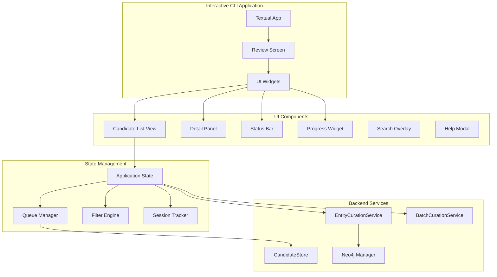
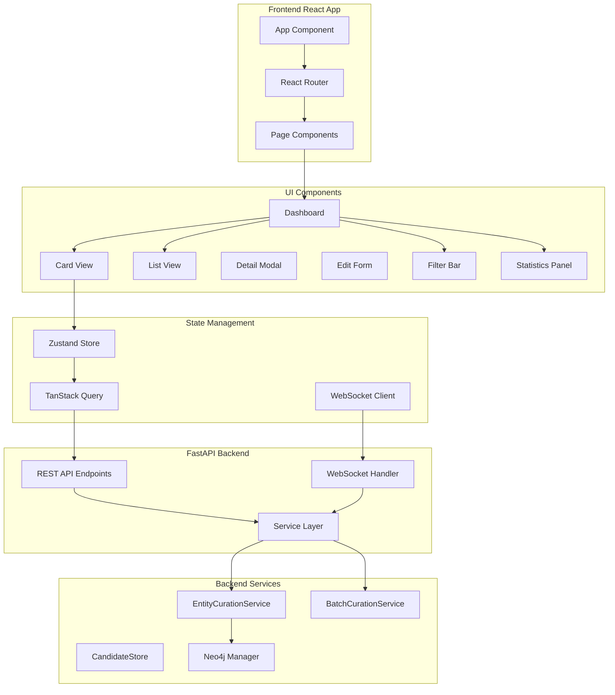
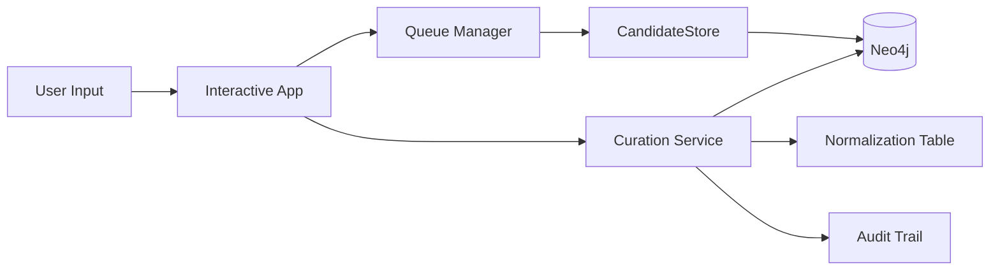
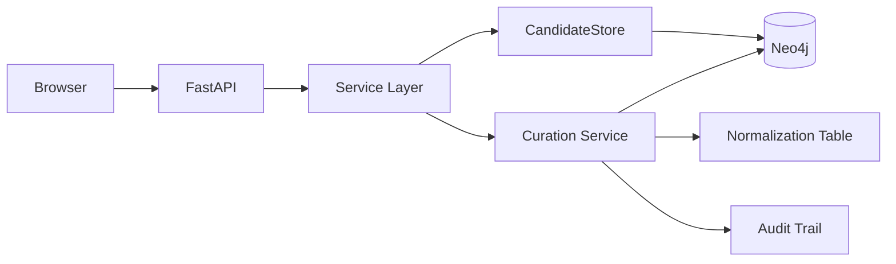

# Phase 3.5: Enhanced Review Interface (Weeks 6.5-7.5)

## Executive Summary

This phase addresses the critical usability challenge of reviewing large volumes of entity and relationship candidates. The current CLI implementation (from Phase 3) becomes cumbersome when processing hundreds or thousands of candidates, requiring too many manual commands and context switches. This plan evaluates two approaches: an enhanced interactive CLI tool and a lightweight web interface, with detailed architecture, implementation tasks, and recommendations.

**Current Pain Points:**
- Repetitive command typing for each action (approve, reject, edit)
- No keyboard navigation between records
- Context switching between viewing queue and performing actions
- Must re-run commands to see updated state
- Batch operations require complex command syntax
- No visual progress tracking
- No ability to flag items for deferred review
- Difficult to compare similar candidates side-by-side

**Recommended Approach:** Start with Enhanced Interactive CLI (Option 1), then optionally add Web Interface (Option 2) in future if team prefers visual approach.

**Timeline:** Weeks 6.5-7.5 (1 week)
**Architecture Reference:** [`graph-rag-architecture.md`](graph-rag-architecture.md)
**Previous Phase:** [Phase 3 - Normalization & Curation](phase-3-normalization-curation.md)

---

## Option 1: Enhanced Interactive CLI Tool

### Overview

Transform the current command-based CLI into an interactive TUI (Text User Interface) with keyboard navigation, single-key actions, and real-time feedback. Think "vim for entity curation" - powerful, keyboard-driven, efficient at scale.

### Key Features

#### 1. Interactive Navigation
- **Arrow keys** (↑↓) to navigate between candidates
- **Page Up/Down** for fast scrolling
- **Home/End** to jump to first/last
- **Tab** to cycle between view modes (queue, flagged, recently processed)
- **/** to enter search mode
- **n/N** to jump to next/previous search result

#### 2. Single-Key Actions
- **`a`** - Approve current candidate
- **`r`** - Reject current candidate
- **`e`** - Edit candidate (opens mini-form)
- **`m`** - Mark for merge (multi-select mode)
- **`f`** - Flag for later review
- **`u`** - Undo last action
- **`?`** - Show help overlay
- **`q`** - Quit application

#### 3. Vim-Style Power Features
- **Visual mode** (`v`) to select multiple candidates
- **`:` command mode** for advanced operations:
  - `:filter type=SYSTEM` - Apply filters
  - `:sort confidence` - Change sorting
  - `:batch-approve >0.9` - Bulk operations
  - `:export flagged.json` - Export subset
- **Marks** (`ma`, `'a`) to bookmark positions in queue

#### 4. Real-Time UI Components
```
╭─────────────────────────────────────────────────────────────────────────────╮
│ Entity Candidate Review Queue                                    [432/1250] │
│ Filter: status=pending | Sort: confidence ↓ | Flagged: 23                   │
├─────────────────────────────────────────────────────────────────────────────┤
│                                                                               │
│ ► [1] power_subsystem                                              [0.95] ⭐ │
│     Type: SYSTEM | Mentions: 45 | Docs: 12                                  │
│     Aliases: EPS, Electrical Power System, Power System                      │
│     Description: Manages satellite electrical power generation and...        │
│     ───────────────────────────────────────────────────────────────────────  │
│     Actions: [A]pprove  [R]eject  [E]dit  [M]erge  [F]lag                  │
│                                                                               │
│   [2] thermal_control_system                                       [0.92]    │
│     Type: SYSTEM | Mentions: 38 | Docs: 10                                  │
│                                                                               │
│   [3] attitude_determination_control                               [0.89]    │
│     Type: SYSTEM | Mentions: 52 | Docs: 15                                  │
│                                                                               │
├─────────────────────────────────────────────────────────────────────────────┤
│ Progress: ████████░░░░░░░░ 34.5% | Session: 128 approved, 23 rejected       │
│ Status: Ready | Press ? for help                                            │
╰─────────────────────────────────────────────────────────────────────────────╯
```

#### 5. Progress Tracking
- **Session statistics**: Approved/rejected/edited counts
- **Progress bar**: Visual completion percentage
- **Velocity metrics**: Candidates per minute
- **Time estimates**: "~2 hours remaining at current pace"
- **Achievement milestones**: "100 candidates reviewed! 🎉"

#### 6. Smart Features
- **Auto-save**: Progress saved continuously
- **Resume support**: Pick up where you left off
- **Conflict detection**: Warn about similar entities
- **Suggestion engine**: "These 5 candidates might be duplicates"
- **Bulk preview**: Review batch operations before applying
- **Context panel**: Show related candidates while reviewing

### Technical Architecture

#### Technology Stack
- **`textual`**: Modern Python TUI framework with reactive components
- **`rich`**: Enhanced terminal formatting (already in use)
- **`typer`**: CLI argument parsing (already in use)
- **`pydantic`**: Data validation (already in use)

#### Component Architecture



#### File Structure
```
src/curation/
├── interactive/
│   ├── __init__.py
│   ├── app.py                    # Main Textual application
│   ├── screens.py                # Review screen definitions
│   ├── widgets/
│   │   ├── __init__.py
│   │   ├── candidate_list.py    # Scrollable candidate list
│   │   ├── detail_panel.py      # Candidate detail view
│   │   ├── status_bar.py        # Status and progress bar
│   │   ├── search_modal.py      # Search overlay
│   │   ├── edit_modal.py        # Edit form modal
│   │   └── help_modal.py        # Help overlay
│   ├── state.py                  # Application state management
│   ├── keybindings.py           # Keyboard shortcut definitions
│   ├── queue_manager.py         # Queue filtering/sorting/pagination
│   └── session_tracker.py       # Session statistics and progress
└── review_interface.py          # Keep existing CLI for scripting

scripts/
└── review_entities_interactive.py  # Launch interactive mode
```

### Implementation Tasks

#### Task 3.5.1: Interactive TUI Foundation
**Priority:** Critical
**Dependencies:** Task 3.7

**Subtasks:**
1. Install and configure `textual` dependency
2. Create basic Textual application structure
3. Implement main review screen layout
4. Set up application state management
5. Create session tracker for progress

**Deliverables:**
- Basic TUI app that launches and displays placeholder content
- Application state model with session tracking
- Navigation between test screens

**Acceptance Criteria:**
- App launches without errors
- Can navigate with arrow keys
- State updates are reflected in UI
- Clean shutdown with `q` key

---

#### Task 3.5.2: Candidate List Widget
**Priority:** Critical
**Dependencies:** Task 3.5.1

**Subtasks:**
1. Create scrollable list widget for candidates
2. Implement candidate row rendering with formatting
3. Add keyboard navigation (↑↓, Page Up/Down, Home/End)
4. Implement row highlighting and selection
5. Add multi-select mode for bulk operations
6. Integrate with CandidateStore for data fetching

**Deliverables:**
- Scrollable list showing entity candidates
- Keyboard navigation working smoothly
- Visual selection indicators

**Acceptance Criteria:**
- List displays candidate data accurately
- Navigation is responsive (<50ms)
- Can select multiple candidates
- Pagination handles large datasets

---

#### Task 3.5.3: Detail Panel Widget
**Priority:** High
**Dependencies:** Task 3.5.2

**Subtasks:**
1. Create detail panel showing full candidate information
2. Display aliases, descriptions, metadata
3. Show source documents and chunk references
4. Add provenance information display
5. Implement dynamic resizing
6. Add syntax highlighting for JSON properties

**Deliverables:**
- Detail panel showing rich candidate information
- Formatted display of nested data

**Acceptance Criteria:**
- All candidate fields displayed properly
- Panel updates when selection changes
- Long text wraps correctly
- JSON properties are readable

---

#### Task 3.5.4: Single-Key Actions
**Priority:** Critical
**Dependencies:** Task 3.5.2, Task 3.5.3

**Subtasks:**
1. Implement keybinding system
2. Add approve action (`a` key)
3. Add reject action (`r` key)
4. Add flag action (`f` key)
5. Add undo action (`u` key)
6. Integrate with EntityCurationService
7. Add confirmation prompts for destructive actions
8. Update UI immediately after actions

**Deliverables:**
- Single-key actions working for all operations
- Visual feedback for action results

**Acceptance Criteria:**
- Actions execute within 200ms
- UI updates immediately
- Undo works for all action types
- Error messages display clearly

---

#### Task 3.5.5: Edit Modal
**Priority:** High
**Dependencies:** Task 3.5.4

**Subtasks:**
1. Create modal dialog for editing
2. Add form fields for editable properties
3. Implement field validation
4. Add auto-complete for entity types
5. Support multi-value fields (aliases)
6. Add save/cancel buttons
7. Keyboard shortcuts for form navigation

**Deliverables:**
- Modal edit form with all candidate fields
- Field validation and error handling

**Acceptance Criteria:**
- Form opens with current values populated
- Can edit all editable fields
- Validation prevents invalid data
- ESC cancels, Enter/Ctrl+S saves

---

#### Task 3.5.6: Search and Filter System
**Priority:** High
**Dependencies:** Task 3.5.2

**Subtasks:**
1. Implement search modal (`/` key)
2. Add fuzzy search across candidate fields
3. Create filter builder for advanced queries
4. Add search result navigation (`n/N` keys)
5. Implement filter persistence
6. Add saved filter presets
7. Create filter status display

**Deliverables:**
- Search modal with fuzzy matching
- Filter system with multiple criteria
- Search result navigation

**Acceptance Criteria:**
- Search returns results in <500ms
- Filters work correctly in combination
- Can save and load filter presets
- Clear visual indication of active filters

---

#### Task 3.5.7: Progress Tracking and Statistics
**Priority:** Medium
**Dependencies:** Task 3.5.1

**Subtasks:**
1. Implement session statistics tracker
2. Create progress bar widget
3. Add velocity calculation (items/minute)
4. Implement time estimation
5. Add milestone notifications
6. Create session summary on exit
7. Add progress export to JSON

**Deliverables:**
- Real-time progress tracking
- Session statistics display
- Time remaining estimation

**Acceptance Criteria:**
- Progress updates in real-time
- Statistics are accurate
- Time estimates are reasonable
- Summary shows on exit

---

#### Task 3.5.8: Batch Operations UI
**Priority:** Medium
**Dependencies:** Task 3.5.2, Task 3.5.4

**Overview:**
Implement multi-select capabilities and batch operations for efficient large-scale curation. Includes visual selection mode, batch approve/reject with preview, and a comprehensive merge workflow for deduplicating entity candidates.

**Subtasks:**

1. **Implement visual selection mode (`v` key)**
   - Add `selection_mode` reactive state to track when in selection mode
   - Add `selected_candidate_ids` set to track selected candidates
   - Toggle selection mode with 'v' key
   - Update subtitle to show selection count when in selection mode
   - Show instructional notification on entering selection mode

2. **Add multi-candidate selection UI**
   - Add checkbox indicators `[✓]` / `[ ]` to CandidateRow
   - Checkboxes appear before navigation cursor `►`
   - Space key toggles selection of current candidate
   - Ctrl+A to select all visible candidates
   - Ctrl+D to deselect all candidates
   - Visual feedback for selection/deselection actions

3. **Create batch operation preview modals**
   - `BatchOperationModal` for approve/reject preview
   - Shows operation type with visual indicator (✓/✗)
   - Displays list of affected candidates with scrolling
   - Shows summary: "Will {operation} X candidates"
   - Reminds user about undo capability
   - Confirm (Enter) / Cancel (Escape) options

4. **Implement batch approve operation**
   - Wire up to `BatchCurationService.batch_approve()`
   - Run in worker thread with `@work(thread=True)`
   - Create checkpoint before operation for rollback
   - Update session statistics (approved count)
   - Clear selection after successful operation
   - Show success notification with count
   - Handle errors with rollback and notification

5. **Implement batch reject operation**
   - Manual loop through selected candidates
   - Create checkpoint before operation for rollback
   - Call `reject_candidate()` for each PENDING candidate
   - Update session statistics (rejected count)
   - Clear selection after successful operation
   - Show success notification with count
   - Rollback all changes on error

6. **Add merge workflow UI (candidate-to-candidate)**
   - **Primary Selection Modal** (`PrimarySelectionModal`)
     - Shows all selected candidates
     - Radio buttons to choose primary candidate
     - Displays key info: name, type, confidence, mentions, description preview
     - Default selection: highest confidence score
     - Clear visual distinction of primary candidate
     - [Select Primary] and [Cancel] buttons

   - **Merge Preview Modal** (`MergePreviewModal`)
     - **Primary section**: Shows chosen primary (highlighted, marked with •)
     - **Duplicates section**: Shows candidates to be merged and rejected
     - **Merged Result Preview**:
       - Canonical name (from primary)
       - Entity type (from primary)
       - Aliases (union of all aliases from all candidates)
       - Description (primary's description, fallback to first with description)
       - Confidence (maximum across all candidates)
       - Mention count (sum across all candidates)
       - Source documents (union of all sources)
     - [Change Primary] button returns to primary selection
     - [Confirm Merge] and [Cancel] buttons

   - **Workflow Steps**:
     1. User selects 2+ PENDING candidates in selection mode
     2. User presses 'M' key
     3. Validation: minimum 2 candidates, filter non-PENDING
     4. If type conflicts exist: show warning but allow continuation
     5. Show PrimarySelectionModal with auto-selected primary
     6. Show MergePreviewModal with detailed merge preview
     7. On confirm: execute merge via `batch_merge_clusters()`
     8. Update statistics, clear selection, reload candidates

7. **Implement merge operation backend integration**
   - Wire up to `BatchCurationService.batch_merge_clusters()`
   - Run in worker thread with `@work(thread=True)`
   - Pass candidates as cluster: `[[primary, ...duplicates]]`
   - Checkpoint/rollback support via BatchCurationService
   - Record merge in session statistics
   - Clear selection after successful merge
   - Show success notification with merged entity name

8. **Add keybindings for batch operations**
   - `v` - Toggle selection mode
   - `Space` - Toggle selection of current candidate (in selection mode)
   - `Ctrl+A` - Select all visible candidates
   - `Ctrl+D` - Deselect all candidates
   - `A` (capital) - Batch approve selected candidates
   - `R` (capital) - Batch reject selected candidates
   - `M` (capital) - Merge selected candidates

9. **Error handling and validation**
   - Minimum 2 candidates for merge
   - Filter out non-PENDING candidates with warning
   - Type conflict warnings (allow but warn)
   - Already approved/rejected warnings
   - Graceful handling of backend errors with rollback
   - User-friendly error messages

**Merge Workflow Implementation Details:**

**What Gets Merged:**
- ✅ **Aliases**: All unique aliases from all candidates
- ✅ **Source Documents**: Union of all source documents
- ✅ **Chunk IDs**: Union of all chunk IDs
- ✅ **Mention Count**: Sum of all mention counts
- ✅ **Confidence**: Maximum confidence score
- ✅ **Description**: Primary's description (fallback to first duplicate with description)
- ✅ **Provenance**: Merged candidate keys stored in entity properties
- ✅ **Normalization Table**: All aliases map to primary's canonical name
- ✅ **Relationships**: RelationshipCandidates involving merged aliases get promoted

**Candidate Status Updates:**
- Primary candidate → `APPROVED`
- Duplicate candidates → `REJECTED`
- New Entity created with `EntityStatus.APPROVED`

**Undo Support:**
- Full rollback via checkpoint system
- Restores all candidate statuses
- Deletes created entity
- Restores normalization table entries
- Accessible via 'u' key after merge

**Deliverables:**
- Visual selection mode with checkbox indicators
- Batch approve/reject with preview modals
- Complete merge workflow with primary selection
- Safe rollback mechanism for all batch operations
- Comprehensive keybindings

**Acceptance Criteria:**
- ✓ Can select multiple candidates visually with Space key
- ✓ Checkboxes show selected state
- ✓ Selection count shown in subtitle
- ✓ Batch approve preview shows affected candidates
- ✓ Batch reject preview shows affected candidates
- ✓ Primary selection modal shows all candidates with key info
- ✓ Merge preview shows detailed merged result
- ✓ Can change primary candidate before confirming
- ✓ Merge creates entity with merged aliases and metadata
- ✓ All batch operations respect confirmation step
- ✓ Can undo all batch operations
- ✓ Selection automatically cleared after operations
- ✓ Session statistics updated correctly
- ✓ Type conflicts warned but allowed
- ✓ Minimum 2 candidates enforced for merge
- ✓ Non-PENDING candidates filtered with warning

**Testing Checklist:**
- [ ] Select 2 candidates, press 'v', Space on each, confirm checkboxes appear
- [ ] Press 'A', confirm preview shows both candidates, confirm approval works
- [ ] Press 'R', confirm preview shows both candidates, confirm rejection works
- [ ] Select 3 candidates, press 'M', confirm primary selection modal appears
- [ ] Choose different primary, confirm merge preview updates
- [ ] Confirm merge, verify entity created with all aliases
- [ ] Press 'u', verify merge undone and candidates restored
- [ ] Select candidates with different types, confirm warning shown
- [ ] Try merge with 1 candidate, confirm error message
- [ ] Try merge with already approved candidate, confirm filtered with warning

**Future Enhancements (Phase 5):**
- Merge candidates into existing entities (not just candidate-to-candidate)
- Entity search and selection for merge targets
- Cross-entity merge preview and validation
- See Phase 5 Task 5.3 for details

---

#### Task 3.5.9: Vim-Style Command Mode
**Priority:** Low
**Dependencies:** Task 3.5.6

**Subtasks:**
1. Implement command mode (`:` key)
2. Add command parser
3. Create command executor
4. Add filter commands
5. Add batch operation commands
6. Implement export commands
7. Add command history and completion

**Deliverables:**
- Command mode with parser
- Common commands implemented
- Command history

**Acceptance Criteria:**
- Commands execute correctly
- Tab completion works
- Command history accessible with ↑↓
- Error messages are helpful

---

#### Task 3.5.10: Advanced Features
**Priority:** Low
**Dependencies:** Task 3.5.2, Task 3.5.6

**Subtasks:**
1. Implement mark system (`ma`, `'a`)
2. Add duplicate detection suggestions
3. Create side-by-side comparison view
4. Add context panel showing related entities
5. Implement auto-resume from last session
6. Add keyboard shortcut customization
7. Create user preferences system

**Deliverables:**
- Advanced navigation features
- Smart suggestions
- Comparison tools

**Acceptance Criteria:**
- Marks work across sessions
- Suggestions are relevant
- Comparison view is readable
- Preferences persist

---

## Option 2: Lightweight Web Interface

### Overview

Build a single-page web application for visual review of candidates. Better for teams preferring visual interfaces, supports mouse-based workflows, and enables remote review sessions.

### Key Features

#### 1. Card-Based Interface
```
┌─────────────────────┐  ┌─────────────────────┐  ┌─────────────────────┐
│ power_subsystem     │  │ thermal_control_... │  │ attitude_determ...  │
│ ⭐ 0.95 · SYSTEM    │  │ 0.92 · SYSTEM       │  │ 0.89 · SYSTEM       │
│                     │  │                     │  │                     │
│ 45 mentions         │  │ 38 mentions         │  │ 52 mentions         │
│ 12 documents        │  │ 10 documents        │  │ 15 documents        │
│                     │  │                     │  │                     │
│ [✓ Approve]         │  │ [✓ Approve]         │  │ [✓ Approve]         │
│ [✎ Edit] [⚑ Flag]  │  │ [✎ Edit] [⚑ Flag]  │  │ [✎ Edit] [⚑ Flag]  │
│ [✗ Reject]          │  │ [✗ Reject]          │  │ [✗ Reject]          │
└─────────────────────┘  └─────────────────────┘  └─────────────────────┘
```

#### 2. Swipe Gestures (Mobile-Friendly)
- **Swipe right** → Approve
- **Swipe left** → Reject
- **Tap** → Expand details
- **Long press** → Quick actions menu

#### 3. Inline Editing
- Click field to edit
- Auto-save on blur
- Real-time validation
- Undo button appears after changes

#### 4. Keyboard Shortcuts
- **`→`** - Approve
- **`←`** - Reject
- **`e`** - Edit mode
- **`f`** - Flag
- **`z`** - Undo
- **`/`** - Search
- Same as CLI for consistency

#### 5. Visual Dashboard
```
╔══════════════════════════════════════════════════════════════╗
║  Entity Review Dashboard                            🔔 23    ║
╠══════════════════════════════════════════════════════════════╣
║                                                               ║
║  📊 Progress: ████████░░░░░░░░ 34.5% (432/1250)             ║
║                                                               ║
║  Today's Stats:                                               ║
║  ✓ Approved: 128  ✗ Rejected: 23  🏁 Flagged: 23            ║
║  ⚡ Velocity: 42/hour  ⏱️ Est. remaining: 2h 15m             ║
║                                                               ║
╠══════════════════════════════════════════════════════════════╣
║  Filters: [Status ▾] [Type ▾] [Confidence ▾] [Search]       ║
║  View: [Cards] [List] [Table]  Sort: [Confidence ▾]         ║
╚══════════════════════════════════════════════════════════════╝
```

#### 6. Batch Tools
- **Select multiple** with checkboxes
- **Bulk approve/reject** selected items
- **Merge wizard** with drag-and-drop
- **Export selection** to JSON/CSV
- **Batch edit** common fields

### Technical Architecture

#### Technology Stack
- **Backend:** FastAPI (Python)
  - Lightweight, async, OpenAPI docs
  - Reuses existing services
  - WebSocket support for real-time updates
- **Frontend:** React + TypeScript
  - Component-based UI
  - State management with Zustand
  - TanStack Query for data fetching
- **Styling:** Tailwind CSS
  - Rapid prototyping
  - Responsive by default
- **Build:** Vite
  - Fast development server
  - Optimized production builds

#### Component Architecture



#### File Structure
```
web/
├── backend/
│   ├── __init__.py
│   ├── main.py                   # FastAPI app
│   ├── api/
│   │   ├── __init__.py
│   │   ├── candidates.py        # Candidate endpoints
│   │   ├── curation.py          # Curation action endpoints
│   │   ├── statistics.py        # Stats endpoints
│   │   └── websocket.py         # Real-time updates
│   ├── models.py                 # Pydantic models for API
│   └── dependencies.py           # Dependency injection
│
├── frontend/
│   ├── src/
│   │   ├── components/
│   │   │   ├── Dashboard.tsx
│   │   │   ├── CandidateCard.tsx
│   │   │   ├── CandidateList.tsx
│   │   │   ├── DetailModal.tsx
│   │   │   ├── EditForm.tsx
│   │   │   ├── FilterBar.tsx
│   │   │   ├── ProgressPanel.tsx
│   │   │   └── StatsWidget.tsx
│   │   ├── hooks/
│   │   │   ├── useCandidates.ts
│   │   │   ├── useCuration.ts
│   │   │   └── useWebSocket.ts
│   │   ├── stores/
│   │   │   └── reviewStore.ts
│   │   ├── types/
│   │   │   └── candidate.ts
│   │   ├── utils/
│   │   │   └── api.ts
│   │   ├── App.tsx
│   │   └── main.tsx
│   ├── package.json
│   ├── vite.config.ts
│   └── tsconfig.json
│
└── docker-compose.web.yml        # Optional: containerized deployment
```

### Implementation Tasks

#### Task 3.5.11: FastAPI Backend Foundation
**Priority:** Critical
**Dependencies:** Task 3.7

**Subtasks:**
1. Set up FastAPI application structure
2. Create REST API endpoints for candidates
3. Implement curation action endpoints
4. Add authentication middleware (optional)
5. Set up CORS configuration
6. Create API documentation with OpenAPI
7. Add request/response validation

**Deliverables:**
- Working FastAPI backend with core endpoints
- API documentation at `/docs`

**Acceptance Criteria:**
- All endpoints return correct data
- CORS allows frontend access
- API docs are comprehensive
- Validation catches invalid requests

---

#### Task 3.5.12: React Frontend Setup
**Priority:** Critical
**Dependencies:** Task 3.5.11

**Subtasks:**
1. Initialize Vite + React + TypeScript project
2. Set up Tailwind CSS
3. Configure React Router
4. Set up TanStack Query
5. Create Zustand store for state
6. Implement API client utilities
7. Set up development environment

**Deliverables:**
- React app scaffolding
- Development server running
- API integration working

**Acceptance Criteria:**
- App builds without errors
- Can fetch data from backend
- Hot reload works
- State management functional

---

#### Task 3.5.13: Card and List Views
**Priority:** High
**Dependencies:** Task 3.5.12

**Subtasks:**
1. Create CandidateCard component
2. Implement CandidateList component
3. Add view switching (cards/list/table)
4. Implement lazy loading/virtualization
5. Add loading skeletons
6. Create responsive layout
7. Add animations and transitions

**Deliverables:**
- Card and list view components
- View switching functionality
- Responsive design

**Acceptance Criteria:**
- Both views display data correctly
- Smooth switching between views
- Performance good with 100+ items
- Mobile-responsive

---

#### Task 3.5.14: Action Buttons and Workflows
**Priority:** Critical
**Dependencies:** Task 3.5.13

**Subtasks:**
1. Implement approve button with API call
2. Implement reject button with confirmation
3. Add flag/unflag functionality
4. Create undo button with toast notification
5. Add optimistic UI updates
6. Implement error handling and retry
7. Add loading states for actions

**Deliverables:**
- All action buttons working
- Optimistic updates
- Error handling

**Acceptance Criteria:**
- Actions execute successfully
- UI updates immediately (optimistic)
- Errors show clear messages
- Can undo recent actions

---

#### Task 3.5.15: Inline Edit Form
**Priority:** High
**Dependencies:** Task 3.5.13

**Subtasks:**
1. Create inline edit mode for cards
2. Implement form validation
3. Add auto-save on blur
4. Create multi-value field editor (aliases)
5. Add type selector dropdown
6. Implement unsaved changes warning
7. Add keyboard shortcuts for editing

**Deliverables:**
- Inline editing functionality
- Auto-save mechanism
- Field validation

**Acceptance Criteria:**
- Click to edit works smoothly
- Auto-save triggers correctly
- Validation prevents bad data
- Unsaved changes are preserved

---

#### Task 3.5.16: Filter and Search UI
**Priority:** High
**Dependencies:** Task 3.5.13

**Subtasks:**
1. Create FilterBar component
2. Add search input with debouncing
3. Implement filter dropdowns
4. Add multi-select filters
5. Create saved filter presets
6. Add filter chips showing active filters
7. Implement URL state for filters

**Deliverables:**
- Complete filter UI
- Search with autocomplete
- Filter persistence

**Acceptance Criteria:**
- Filters work in combination
- Search is fast (<300ms)
- Can save and load presets
- URL reflects current filters

---

#### Task 3.5.17: Dashboard and Statistics
**Priority:** Medium
**Dependencies:** Task 3.5.12

**Subtasks:**
1. Create Dashboard layout
2. Implement ProgressPanel component
3. Add StatsWidget with charts
4. Create session tracker
5. Add velocity calculation
6. Implement achievement notifications
7. Add export functionality for stats

**Deliverables:**
- Dashboard with statistics
- Progress visualization
- Session tracking

**Acceptance Criteria:**
- Stats update in real-time
- Charts are accurate
- Progress bar works correctly
- Can export session data

---

#### Task 3.5.18: Batch Operations UI
**Priority:** Medium
**Dependencies:** Task 3.5.13, Task 3.5.14

**Subtasks:**
1. Add checkbox selection to cards/list
2. Implement select all/none
3. Create batch action toolbar
4. Add batch preview modal
5. Implement merge wizard with drag-drop
6. Add bulk edit form
7. Create rollback mechanism

**Deliverables:**
- Batch selection UI
- Batch operation tools
- Merge wizard

**Acceptance Criteria:**
- Can select multiple items
- Batch operations work correctly
- Preview shows affected items
- Can undo batch operations

---

#### Task 3.5.19: WebSocket Real-Time Updates
**Priority:** Low
**Dependencies:** Task 3.5.11, Task 3.5.12

**Subtasks:**
1. Implement WebSocket endpoint in backend
2. Create WebSocket client in frontend
3. Add real-time candidate updates
4. Implement collaborative editing notifications
5. Add connection status indicator
6. Handle reconnection logic
7. Add rate limiting

**Deliverables:**
- WebSocket connection
- Real-time updates
- Collaborative features

**Acceptance Criteria:**
- Updates appear without refresh
- Handles disconnections gracefully
- Shows when others are reviewing
- No performance degradation

---

#### Task 3.5.20: Mobile Optimization and Gestures
**Priority:** Low
**Dependencies:** Task 3.5.13

**Subtasks:**
1. Implement touch gesture library
2. Add swipe left/right for approve/reject
3. Create mobile-optimized layout
4. Add touch-friendly button sizes
5. Implement pull-to-refresh
6. Add mobile navigation menu
7. Test on multiple devices

**Deliverables:**
- Mobile-optimized interface
- Swipe gestures
- Touch interactions

**Acceptance Criteria:**
- Works well on phones/tablets
- Gestures feel natural
- No accidental actions
- Performance is smooth

---

## Comparative Analysis

### Usability Comparison

| Aspect | Enhanced CLI | Web Interface |
|--------|-------------|---------------|
| **Learning Curve** | Steeper (keyboard shortcuts) | Gentler (visual/intuitive) |
| **Speed (experienced users)** | Faster (keyboard-driven) | Slower (mouse/touch) |
| **Speed (new users)** | Slower (must learn shortcuts) | Faster (self-explanatory) |
| **Cognitive Load** | Lower (minimalist UI) | Higher (more visual elements) |
| **Multi-tasking** | Difficult (terminal-based) | Easy (browser tab) |
| **Remote Access** | Requires SSH/VPN | Easy (web browser) |
| **Collaboration** | Difficult | Easy (share URL) |
| **Visual Feedback** | Limited by terminal | Rich (colors, animations) |
| **Data Visualization** | Limited | Excellent (charts, graphs) |
| **Accessibility** | Screen reader friendly | Depends on implementation |

### Technical Comparison

| Aspect | Enhanced CLI | Web Interface |
|--------|-------------|---------------|
| **Development Time** | 1 week | 2-3 weeks |
| **Maintenance Complexity** | Low | Medium |
| **Dependencies** | Minimal (textual, rich) | Many (React, FastAPI, build tools) |
| **Deployment** | pip install | Web server + frontend hosting |
| **Performance** | Excellent | Good (network dependent) |
| **Resource Usage** | Minimal | Moderate (browser overhead) |
| **Security** | Local access only | Requires auth/HTTPS |
| **Testing Complexity** | Low | High (E2E testing) |
| **Browser Compatibility** | N/A | Must support multiple browsers |
| **Offline Support** | Native | Requires PWA implementation |

### Team Fit Assessment

#### Choose Enhanced CLI if:
- ✅ Team is technical and comfortable with terminals
- ✅ Reviewers prefer keyboard-driven workflows
- ✅ Fast deployment is critical
- ✅ Want minimal maintenance overhead
- ✅ All work is done on development machines
- ✅ Security/access control not a concern (local-only)
- ✅ Budget/time is limited

#### Choose Web Interface if:
- ✅ Team prefers visual/graphical interfaces
- ✅ Need remote access for distributed team
- ✅ Want collaborative features
- ✅ Non-technical users will perform reviews
- ✅ Need rich data visualization
- ✅ Mobile/tablet access is valuable
- ✅ Can invest time in frontend development

### Performance Characteristics

#### Enhanced CLI
- **Startup Time:** <1 second
- **Navigation:** <50ms per action
- **Large Datasets:** Handles 10,000+ candidates smoothly
- **Memory:** ~50-100 MB
- **Network:** None (local only)

#### Web Interface
- **Initial Load:** 2-3 seconds (cold start)
- **Navigation:** 100-200ms per action (network dependent)
- **Large Datasets:** Requires pagination/virtualization
- **Memory:** ~200-500 MB (browser overhead)
- **Network:** Continuous (API calls)

---

## Recommended Implementation Strategy

### Phase 3.5: Start with Enhanced CLI (Recommended)

**Rationale:**
1. **Faster Time-to-Value:** 1 week vs 2-3 weeks
2. **Lower Risk:** Fewer dependencies and moving parts
3. **Better Performance:** Native terminal performance
4. **Team Alignment:** Technical team comfortable with CLI
5. **Existing Foundation:** Builds on current CLI tool (Task 3.6)
6. **Minimal Deployment:** Just `uv run ragagent-review-interactive`

**Implementation Order:**
1. Days 1-2: Foundation + Navigation (Tasks 3.5.1, 3.5.2)
2. Days 3-4: Actions + Detail View (Tasks 3.5.3, 3.5.4, 3.5.5)
3. Day 5: Search/Filter + Progress (Tasks 3.5.6, 3.5.7)
4. Days 6-7: Batch Operations + Polish (Tasks 3.5.8, optional 3.5.9, 3.5.10)

### Optional Future: Add Web Interface

If team feedback indicates desire for web interface or remote access becomes critical:

**Implementation Order:**
1. Week 1: Backend API (Tasks 3.5.11)
2. Week 2: Core Frontend (Tasks 3.5.12, 3.5.13, 3.5.14)
3. Week 3: Advanced Features (Tasks 3.5.15, 3.5.16, 3.5.17)
4. Week 4: Polish + Deployment (Tasks 3.5.18, 3.5.19, 3.5.20)

### Hybrid Approach

Both can coexist:
- **CLI** for power users and automated workflows
- **Web** for casual reviewers and visual exploration
- **Shared backend** services (EntityCurationService, etc.)

---

## Integration with Existing System

### Preserves Current Functionality
Both approaches maintain compatibility with:
- ✅ Current Neo4j schema
- ✅ EntityCurationService operations
- ✅ BatchCurationService workflows
- ✅ Normalization table
- ✅ Audit trail
- ✅ Undo mechanism
- ✅ Config system

### Data Flow (Enhanced CLI)


### Data Flow (Web Interface)


---

## Success Metrics

### Efficiency Metrics
- **Review Speed:** >30 candidates/hour (vs <10 currently)
- **Error Rate:** <5% incorrect approvals/rejections
- **Undo Usage:** <10% of actions (indicates good initial decisions)
- **Session Length:** 45-60 minutes (sustainable review sessions)

### Quality Metrics
- **Duplicate Detection:** 90%+ of duplicates caught
- **Consistency:** Same candidates reviewed by different users agree 85%+
- **Completion Rate:** 95%+ of candidates reviewed (not flagged indefinitely)

### User Experience Metrics
- **Learning Time:** <30 minutes to become proficient (CLI) or <10 minutes (Web)
- **User Satisfaction:** >4/5 rating
- **Task Completion:** 100% of users can approve/reject/edit without help
- **Feature Usage:** >50% of users use advanced features (search, batch ops)

### System Metrics
- **Response Time:** <200ms for all actions
- **Crash Rate:** <0.1% of sessions
- **Data Integrity:** Zero data loss incidents
- **Undo Success:** 100% of undo operations succeed

---

## Risk Assessment and Mitigation

### Risk 1: Textual Library Learning Curve
**Impact:** Medium | **Probability:** Medium

**Mitigation:**
- Start with simple layouts and progressively add complexity
- Reference Textual documentation and examples
- Build proof-of-concept early to validate approach
- Have fallback to simpler terminal UI if needed

### Risk 2: Performance with Large Datasets
**Impact:** Medium | **Probability:** Low

**Mitigation:**
- Implement efficient pagination
- Use virtual scrolling for lists
- Add data prefetching and caching
- Benchmark with realistic data volumes early

### Risk 3: Web Interface Scope Creep
**Impact:** High | **Probability:** High

**Mitigation:**
- Start with CLI to prove value quickly
- Define strict MVP scope for web interface
- Time-box web development
- Launch CLI first, web as v2

### Risk 4: Keyboard Shortcut Conflicts
**Impact:** Low | **Probability:** Medium

**Mitigation:**
- Make shortcuts customizable
- Follow standard conventions (vim, emacs)
- Provide clear help documentation
- Allow modal dialogs to override base shortcuts

### Risk 5: User Adoption Resistance
**Impact:** High | **Probability:** Low

**Mitigation:**
- Keep existing CLI commands for scripts/automation
- Provide training/documentation
- Gather early user feedback
- Show efficiency gains with metrics

---

## Testing Strategy

### Enhanced CLI Testing

**Unit Tests:**
- Widget rendering
- State management
- Keybinding handlers
- Queue filtering/sorting

**Integration Tests:**
- Full app lifecycle
- Service integration
- State persistence
- Undo/redo operations

**Manual Testing:**
- Keyboard navigation
- Visual appearance
- Performance with large queues
- Edge cases (empty queue, errors)

**User Acceptance Testing:**
- Complete review workflow
- Batch operations
- Search and filter
- Session resume

### Web Interface Testing

**Unit Tests:**
- React components
- API client
- State management
- Utility functions

**Integration Tests:**
- API endpoints
- Frontend-backend integration
- WebSocket communication
- Authentication flow

**E2E Tests (Playwright/Cypress):**
- Complete workflows
- Multi-user scenarios
- Mobile responsiveness
- Cross-browser compatibility

**Performance Testing:**
- Load testing API endpoints
- Frontend rendering performance
- Network latency simulation

---

## Documentation Requirements

### For Users
1. **Quick Start Guide** - Get up and running in 5 minutes
2. **Keyboard Shortcuts Reference** - Printable cheat sheet
3. **Review Best Practices** - Guidelines for consistent curation
4. **Troubleshooting Guide** - Common issues and solutions
5. **Video Tutorials** - Screencasts for visual learners

### For Developers
1. **Architecture Overview** - System design and components
2. **Component Documentation** - Each widget/component explained
3. **API Reference** (for web) - All endpoints documented
4. **State Management Guide** - How app state works
5. **Extension Guide** - How to add new features

---

## Deployment and Operations

### Enhanced CLI Deployment
```bash
# Development
uv run ragagent-review-interactive --config config/config.yaml

# Production
pip install -e .
ragagent-review-interactive
```

### Web Interface Deployment

**Development:**
```bash
# Backend
cd web/backend
uvicorn main:app --reload

# Frontend
cd web/frontend
npm run dev
```

**Production:**
```bash
# Option 1: Docker Compose
docker-compose -f web/docker-compose.web.yml up -d

# Option 2: Traditional
# Backend: Gunicorn + Uvicorn workers
gunicorn web.backend.main:app -k uvicorn.workers.UvicornWorker

# Frontend: Nginx serving static build
npm run build
# Deploy build/ to Nginx/CDN
```

---

## Cost-Benefit Analysis

### Enhanced CLI
**Development Cost:** 1 week
**Benefits:**
- 3x faster review speed → saves ~20 hours/month for large datasets
- Reduced errors → higher quality knowledge graph
- Lower maintenance → saves ~2 hours/month
- Better user experience → increased productivity

**ROI:** Positive within 1 month for teams reviewing 1000+ candidates

### Web Interface
**Development Cost:** 2-3 weeks
**Benefits:**
- Same speed improvements as CLI
- Enables remote collaboration
- Lowers barrier for non-technical users
- Better visibility for stakeholders

**ROI:** Positive within 2 months for distributed teams or 3+ months for co-located teams

---

## Conclusion and Recommendation

**Primary Recommendation: Implement Enhanced Interactive CLI (Option 1)**

**Reasoning:**
1. **Fastest path to value** - 1 week vs 2-3 weeks
2. **Lower risk** - Fewer dependencies, simpler architecture
3. **Better performance** - Native terminal performance
4. **Team fit** - Technical team comfortable with CLI tools
5. **Extensibility** - Can add web interface later if needed
6. **Cost-effective** - Less development and maintenance overhead

**Implementation Plan:**
1. **Days 1-2:** Foundation + Navigation (Tasks 3.5.1, 3.5.2)
2. **Days 3-4:** Actions + Details (Tasks 3.5.3, 3.5.4, 3.5.5)
3. **Day 5:** Search/Filter + Progress (Tasks 3.5.6, 3.5.7)
4. **Days 6-7:** Batch + Polish (Tasks 3.5.8, optional 3.5.9, 3.5.10)

**Future Consideration:**
Evaluate web interface (Option 2) after 3 months if:
- Team requests visual interface
- Remote access becomes critical
- Non-technical users need to perform reviews
- Collaborative features are desired

Both solutions address the core problem of scaling entity review, but the enhanced CLI provides the fastest path to relieving the current pain points while maintaining flexibility for future enhancements.

---

## Appendix A: Alternative Technologies Considered

### CLI Frameworks
- **`textual`** ✅ - Modern, reactive, well-documented
- **`urwid`** ❌ - Older, more complex API
- **`py-cui`** ❌ - Less mature, smaller community
- **`blessed`** ❌ - Lower-level, more manual work

### Web Frameworks (Backend)
- **`FastAPI`** ✅ - Modern, async, great DX
- **`Flask`** ❌ - Synchronous, older patterns
- **`Django`** ❌ - Too heavy for this use case

### Web Frameworks (Frontend)
- **`React`** ✅ - Mature ecosystem, good performance
- **`Vue`** ⚠️ - Good alternative, smaller ecosystem
- **`Svelte`** ⚠️ - Excellent performance, less mature
- **`HTMX + Alpine.js`** ❌ - Simpler but less interactive

---

## Appendix B: User Stories

### As a Data Curator...
1. I want to review candidates quickly so I can process large volumes
2. I want to see similar entities side-by-side so I can catch duplicates
3. I want to undo mistakes immediately so I don't corrupt the knowledge graph
4. I want to save my progress so I can resume later
5. I want to flag difficult decisions so I can revisit them
6. I want to see my productivity metrics so I can track progress

### As a Project Lead...
1. I want to see team curation statistics so I can track project progress
2. I want to ensure data quality so the knowledge graph is reliable
3. I want to audit curation decisions so I can verify quality
4. I want minimal training overhead so new team members can contribute quickly

### As a System Administrator...
1. I want easy deployment so I can get the tool running quickly
2. I want reliable undo functionality so users can fix mistakes
3. I want comprehensive logging so I can debug issues
4. I want performance monitoring so I can optimize the system

---

## Appendix C: Mockups and Wireframes

*Note: Detailed mockups would be created during design phase. This plan focuses on functional requirements and architecture.*

**CLI Mockup:** See section "Real-Time UI Components" for ASCII representation

**Web Mockup:** See section "Card-Based Interface" and "Visual Dashboard" for layout concepts

---

**Next Phase:** [Phase 4 - Retrieval System](phase-4-retrieval-system.md)

---

## Deferred Items (Moved to Phase 6)

The following "Advanced Features" were deferred during Phase 3.5 implementation to prioritize core stability. They have been moved to [Phase 6 - Discovery & Polish](phase-6-discovery-polish.md).

1.  **Flagging System:** Requires schema update to support `CandidateStatus.FLAGGED` or a dedicated property. Currently shows "Coming Soon".
2.  **Sort Command (`:sort`):** Parser works, but backend implementation pending.
3.  **Export Command (`:export`):** Parser works, but export logic pending.
4.  **Help Screen (`?`):** Placeholder notification currently shown.
5.  **Comparison Actions:** "Select different candidates" logic pending.

**Document Version:** 1.1
**Last Updated:** 2025-12-22
**Status:** Completed
**Next Steps:** Proceed to Phase 4 (Retrieval System)
